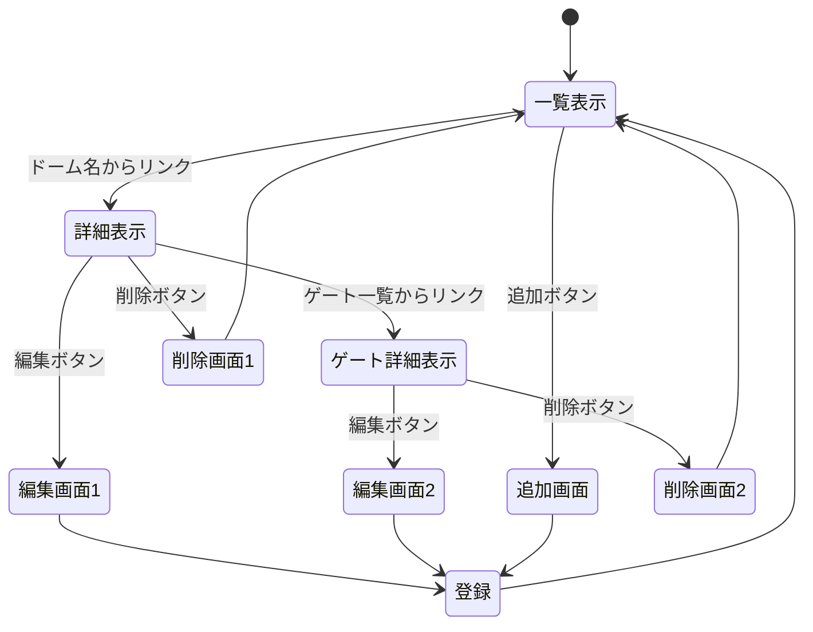

# 開発者用仕様書（仮）

## 概要
本アプリケーションは，Node.jsを使用したWebアプリケーションである．ドーム（会場）情報というリソースに対し，CRUD（作成，読み取り，更新，削除）操作を提供する．

## データ構造
キー名 | データ型 | 説明 
-|-|-
id | Number | 一意の識別子 
place | String | 都道府県 
name | String | 会場名 
station | String | 最寄り駅 
capa | String | 収容人数 
geta | String, Number | ゲート一覧 

## ページ遷移
- 遷移図

- HTTPメソッドとリソース名

目的 | リソース名 | HTTPメソッド | 遷移先 |
-|-|-|-|
ドーム一覧表示 | /dome | GET | dome.ejs
追加 | /dome/create | GET | /dome
ゲート詳細表示 | /dome/:number | GET | dome_detail.ejs
編集 | /dome/edit/:number | GET | dome_edit.ejs
削除 | /dome/delete/:number | GET | /dome
ゲート一覧表示 | /dome_detail/:number | GET | dome_gate.ejs
登録 | /dome | POST | /dome

